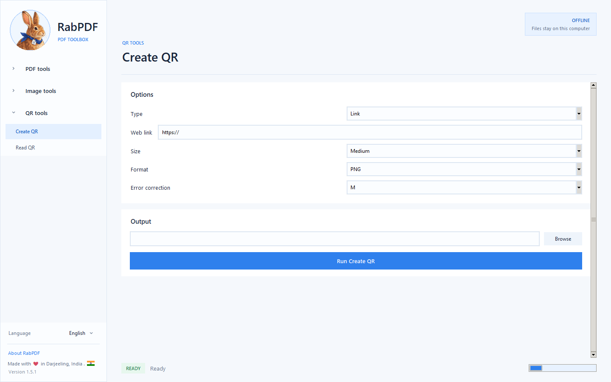

# RabPDF

PDF made simple.

Official free portable Windows downloads. No Python or supporting packages
need to be installed. This repository hosts downloads, not application source.

## Download

[Download the latest Windows release](https://github.com/nishanchettri/RabPDF-Releases/releases/latest)

- **RabPDF-Windows-1.5.7.exe:** download and double-click to run.
- **RabPDF-Windows-1.5.7-FastStart.zip:** extract first, then run RabPDF.exe.
  Keep the included _internal folder alongside the executable. This edition
  starts faster.
- **SHA256SUMS.txt:** checksums for verifying the download bytes.

These builds are unsigned. Windows SmartScreen or antivirus software may
display a warning. A checksum verifies file integrity, not publisher trust.
Do not disable antivirus protection to run the app.

## Privacy and support

Document processing and image upscaling happen locally. No RabPDF account,
developer analytics, or ads are required. Files you choose to export to a
cloud-synced folder may be uploaded by your storage provider.

Do not post private PDFs, identification documents, passwords, or personal
information in public issues. Report problems without sensitive files.

Contact: ciao@monkeywithbrain.in

Instagram: [@RabPDF](https://www.instagram.com/RabPDF/)

Made with ❤️ in Darjeeling.

## Release information

See [installation instructions](INSTALL.md), [release notes](RELEASE-NOTES.md),
[Windows privacy information](PRIVACY.md), and [license notices](licenses/).

Standalone fonts, wordmarks, stickers and brand source files are not distributed here.

Main controls support English, German, Italian, French, Spanish, Portuguese and Nepali.
Some detailed help and error messages remain English. Windows 1.5.7 includes
PDF input-list file drops and offline QR creation/reading. Physical Explorer
drag gestures and installed-MSIX workflows still need further testing.

Public binary downloads do not prevent reverse engineering. The existing MIT
license is retained; it grants copying and modification permissions. This is
a downloads-only repository, not a declaration of proprietary licensing.

## Android and Microsoft Store

- [Android 0.5.11 APK](https://github.com/nishanchettri/RabPDF-Releases/releases/tag/android-v0.5.11): package app.rabpdf.android, version code 16. Direct installation does not guarantee Google Play purchases/restoration or Play-protected build availability.
- [Join the Android closed test](https://play.google.com/apps/testing/app.rabpdf.android), after joining https://groups.google.com/g/rabpdf/about with the same Google account.
- [Microsoft Store listing](https://apps.microsoft.com/detail/9NR013R01KW7): availability depends on Store publication.
- The Windows 1.5.7 release also includes the unsigned MSIX prepared for Microsoft Store upload. It is not a normal sideload installer and does not establish certification or publication.

Android documents process locally, but Google scanner services may collect diagnostics, usage information and identifiers. Purchases use Google Play. Android privacy policy: https://monkeywithbrain.in/RabPDF/privacy.html
